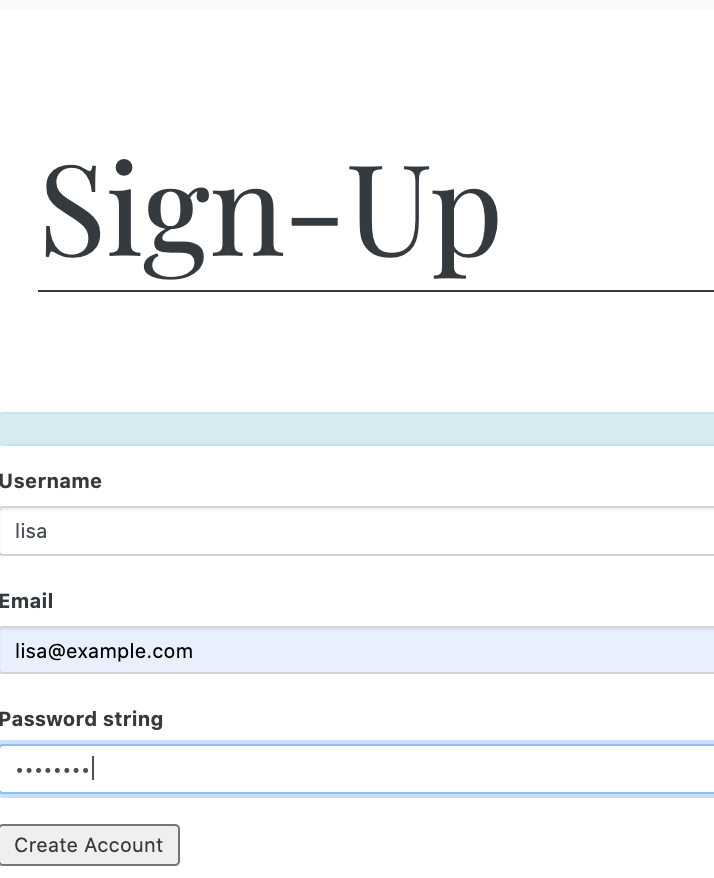
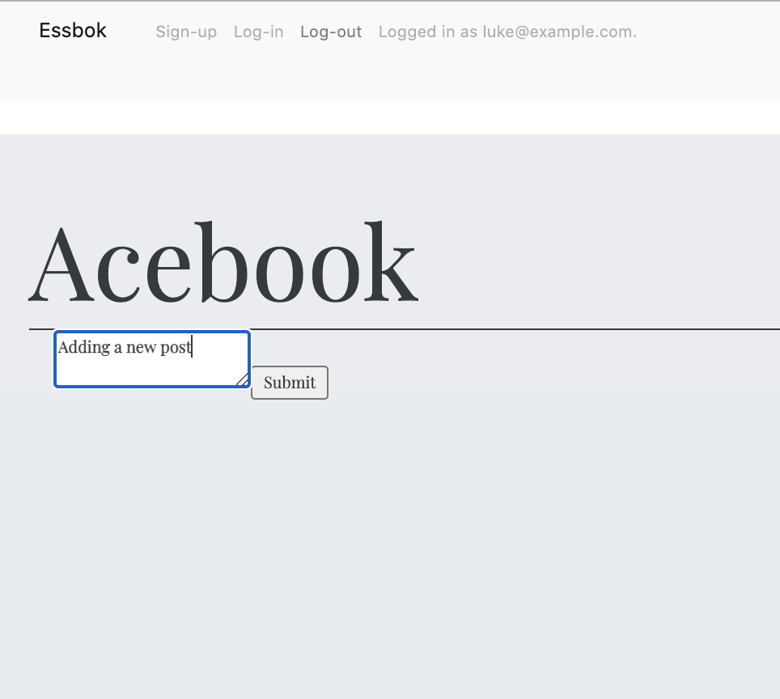
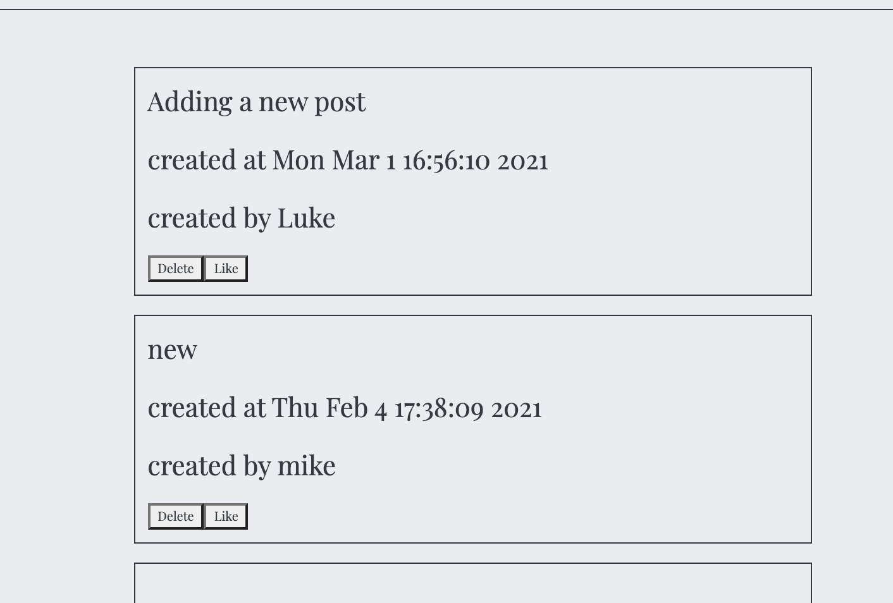
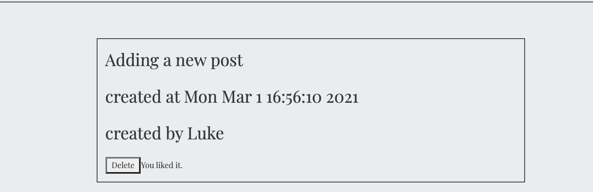

# AceBook

A social media platform where user can add a post and like other people's posts.

In order to add a post, user needs to sign up and login. 

## Build status

[](https://github.com/Will-Helliwell/acebook-on-the-rails)


## How to run the app


From your local machine, clone this repository

```
git clone https://github.com/lisabardelli/acebook-on-the-rails.git
```

Move to the project directory

```
cd acebook-on-the-rails
```

Run the following to create the database

```bash
> bundle install
> bin/rails db:create
> bin/rails db:migrate
```

Start the server and the visit localhost:3000
```
> bin/rails server 
```

## How to run the tests

```bash
> rspec
```

## **App**
## **Sign up**

## **Add post**


## **Like post**


## Heroku link

[Visit live deployment](https://acebook-on-the-rails.herokuapp.com/)


